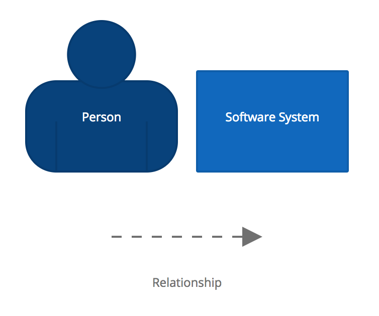

# Getting started

Here is a quick overview of how to get started with Structurizr for .NET so that you can create a software architecture model as code. You can find the code at [GettingStarted.cs](https://github.com/structurizr/dotnet/blob/master/Structurizr.Examples/GettingStarted.cs) and the live example workspace at [https://structurizr.com/share/25441](https://structurizr.com/share/25441).

For more examples, please see [Structurizr.Examples](https://github.com/structurizr/dotnet/tree/master/Structurizr.Examples).

## 1. Dependencies

The "Structurizr for .NET" assemblies are available on NuGet as follows:

Name                                          | Description
-------------------------------------------   | -------------------------------------------------------------------------------------------------------------------------
Structurizr.Core | The core library that can used to create and upload software architecture models to Structurizr.

To install Structurizr.Core, use the following command in the NuGet Package Manager Console:

```
Install-Package Structurizr.Core
```

## 2. Create a model

The first step is to create a workspace in which the software architecture model will reside.

```c#
Workspace workspace = new Workspace("Getting Started", "This is a model of my software system.");
Model model = workspace.Model;
```

Now let's add some elements to the model to describe a user using a software system.

```c#
Person user = model.AddPerson("User", "A user of my software system.");
SoftwareSystem softwareSystem = model.AddSoftwareSystem("Software System", "My software system.");
user.Uses(softwareSystem, "Uses");
```

## 3. Create some views

With the model created, we need to create some views with which to visualise it.

```c#
ViewSet viewSet = workspace.Views;
SystemContextView contextView = viewSet.CreateSystemContextView(softwareSystem, "SystemContext", "An example of a System Context diagram.");
contextView.AddAllSoftwareSystems();
contextView.AddAllPeople();
```

## 4. Add some colour

Elements and relationships can be styled by specifying colours, sizes and shapes.

```c#
Styles styles = viewSet.Configuration.Styles;
styles.Add(new ElementStyle(Tags.SoftwareSystem) { Background = "#1168bd", Color = "#ffffff" });
styles.Add(new ElementStyle(Tags.Person) { Background = "#08427b", Color = "#ffffff", Shape = Shape.Person });
```

## 5. Upload to Structurizr

Structurizr provides a web API to get and put workspaces.

```c#
StructurizrClient structurizrClient = new StructurizrClient("key", "secret");
structurizrClient.PutWorkspace(25441, workspace);
```

> In order to upload your model to Structurizr using the web API, you'll need to [sign up for free](https://structurizr.com/signup) to get your own API key and secret. See [Workspaces](https://structurizr.com/help/workspaces) for information about finding your workspace ID, API key and secret.

The result is a diagram like this (once you've dragged the boxes around).


A diagram key is automatically generated based upon the styles in the model. Click the 'i' button on the toolbar (or press the 'i' key) to display the diagram key.

