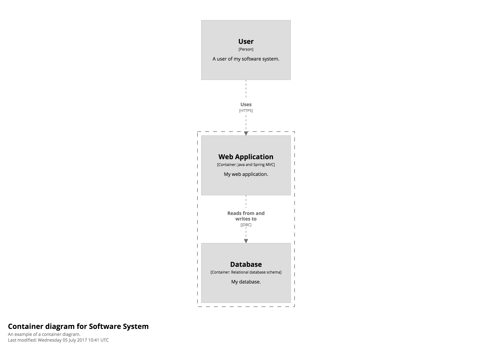
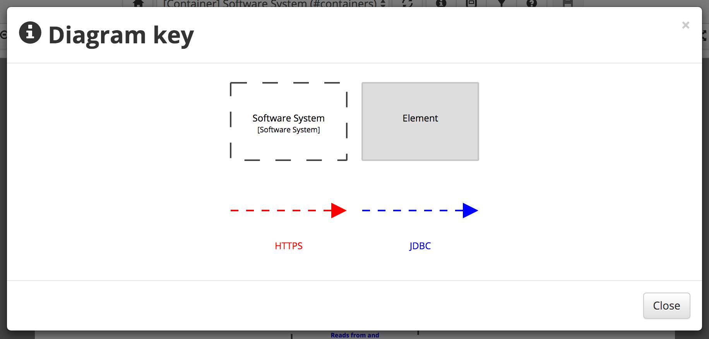

# Styling relationships

By default, all relationships are rendered as dashed grey lines as shown in the example diagram below.



However, the following characteristics of the relationships can be customized:

- Line thickness (pixels)
- Colour (HTML hex value)
- Dashed (true or false)
- Routing (Direct or Orthogonal; see the [Routing](https://github.com/structurizr/dotnet/blob/master/Structurizr.Core/View/Routing.cs) enum)
- Font size (pixels)
- Width (of the description, in pixels)
- Position (of the description along the line, as a percentage from start to end)
- Opacity (an integer between 0 and 100)

## Tagging relationships

All relationships within a software architecture model can have one or more tags associated with them. A tag is simply a free-format string. By default, the Java client library adds the ```"Relationship"``` tag to relationships. As we'll see shortly, you can add your own custom tags to relationships using the ```AddTags()``` method on the relationship.

## Colour

To style a relationship, simply create a [RelationshipStyle](https://github.com/structurizr/dotnet/blob/master/Structurizr.Core/View/RelationshipStyle.cs) for a particular tag and specify the characteristics that you would like to change. For example, you can change the colour of all relationships as follows.

```java
Styles styles = workspace.Views.Configuration.Styles;
styles.Add(new RelationshipStyle(Tags.Relationship) { Color = "#ff0000" });
```


You can also change the colour of specific relationships, based upon their tag, as follows.

```java
model.Relationships.Where(r => "HTTPS".Equals(r.Technology)).ToList().ForEach(r => r.AddTags("HTTPS"));
model.Relationships.Where(r => "JDBC".Equals(r.Technology)).ToList().ForEach(r => r.AddTags("JDBC"));
styles.Add(new RelationshipStyle("HTTPS") { Color = "#ff0000" });
styles.Add(new RelationshipStyle("JDBC") { Color = "#0000ff" });
```


## Diagram key

Structurizr will automatically add all relationship styles to a diagram key.



You can find the code for this example at [StylingRelationships.cs](https://github.com/structurizr/dotnet/blob/master/Structurizr.Examples/StylingRelationships.cs) and the live example workspace at [https://structurizr.com/share/36131](https://structurizr.com/share/36131).